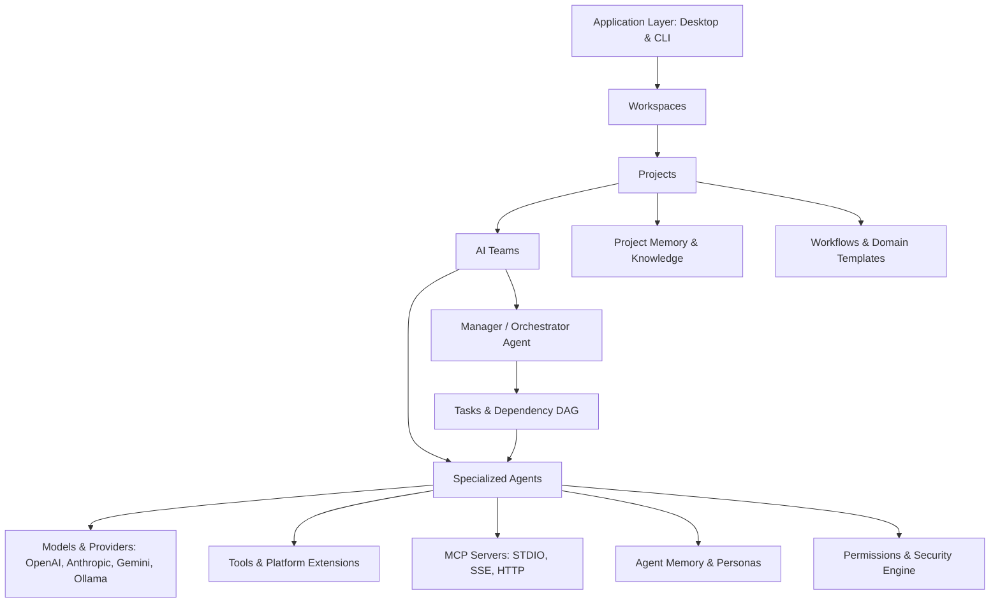

# Architecture Target: Local AI Team Platform

## 1. System Overview & Hierarchy

The **Local AI Team Platform** introduces a layered, domain-driven architecture that wraps and orchestrates the underlying Goose execution engine. The target hierarchy is structured as follows:



---

## 2. Core Entities & Data Model

### 2.1. Application
The top-level desktop container (Electron + React 19) or headless CLI daemon. Manages runtime lifecycles, global configuration, system keyring access, and IPC relays to background services.

### 2.2. Workspace
A logical and physical namespace for a company, business, or operational domain.
- **Attributes**: `id`, `name`, `root_directory`, `created_at`, `settings`.
- **Isolation**: Each workspace maintains isolated credential sets and configuration files.

### 2.3. Project
A focused objective, repository, or business initiative inside a workspace.
- **Attributes**: `id`, `workspace_id`, `name`, `description`, `working_dir`, `team_id`, `created_at`, `archived_at`.
- **Boundaries**:
  - Contains its own file roots, vector index, and task history.
  - No memory or context leaks across projects.
  - Maps to Goose sessions via `project_id`.

### 2.4. AI Team
A collaborative grouping of agents configured with a defined organizational topology.
- **Attributes**: `id`, `project_id`, `name`, `topology` (`ManagerWorker`, `Pipeline`, `PeerReview`, `Swarm`), `manager_agent_id`, `member_agent_ids`.
- **Communication Protocol**: Inter-agent message passing mediated by the Manager or direct peer channels with observable event logs.

### 2.5. Agent Definition
A persistent, reusable specification of an autonomous worker.
- **Attributes**:
  - `id`: Unique UUID.
  - `name`: Display name (e.g., "Senior Market Researcher").
  - `role`: Functional job description.
  - `system_prompt`: Core instructions, persona, and output constraints.
  - `model_provider`: Target provider (e.g., `anthropic`, `ollama`, `google`, `openai`).
  - `model_name`: Specific model ID (e.g., `claude-3-7-sonnet`, `llama3.3:70b`, `gemini-2.5-flash`).
  - `model_parameters`: Temperature, top_p, max_tokens, reasoning_effort.
  - `enabled_tools`: List of built-in tool identifiers.
  - `mcp_servers`: Set of MCP server configurations attached to this agent.
  - `permission_policy`: Granular allow/prompt/deny rules.
  - `memory_scope`: Read/write access rules to project and personal memory.

### 2.6. Task & Execution DAG
A structured unit of work dispatched to an agent or team.
- **Attributes**: `id`, `project_id`, `parent_task_id`, `title`, `description`, `assigned_agent_id`, `status` (`Pending`, `Ready`, `Running`, `WaitingApproval`, `Completed`, `Failed`, `Cancelled`), `dependencies` (`Vec<TaskId>`), `input_data`, `output_result`, `turn_count`, `cost_estimate`.
- **Concurrency**: Tasks whose dependencies are met execute in parallel across independent agent runtime threads.

### 2.7. Models & Providers
Hardware- and cloud-neutral model access. Every agent specifies its own provider independently:
- **Cloud High-Reasoning**: Anthropic Claude 3.7 Sonnet / Opus, OpenAI o3-mini / GPT-4o, Google Gemini 2.5 Pro.
- **Local Private Models**: Ollama (Llama 3.3, DeepSeek R1, Mistral, Qwen 2.5) or embedded Candle local inference.
- **Enterprise Endpoints**: Azure OpenAI, Databricks, OpenRouter.

### 2.8. Tools & Extensions
Local platform operations available to agents:
- File system access (sandboxed to project working directory).
- Command execution (guarded by permission policies).
- Web browsing and documentation fetching.
- Specialized domain calculators (financial models, unit conversion, format translators).

### 2.9. Model Context Protocol (MCP)
Dynamic runtime integrations with third-party software, databases, and APIs:
- Postgres, SQLite, GitHub, Linear, Slack, Google Drive, Local File Search.
- Per-agent MCP server assignment: Agent A can access GitHub MCP while Agent B has access to Financial Database MCP.

### 2.10. Memory Architecture
Multi-tiered local storage engine:
1. **Turn Memory**: Real-time sliding window managed by Goose context compaction.
2. **Agent Persona Memory**: Learned rules, style preferences, and correction feedback stored locally in SQLite (`agent_memory`).
3. **Project Vector Memory**: Semantic chunking and vector embeddings (via local Candle or fast embedding APIs) over project documents, past deliverables, and guidelines.

### 2.11. Permissions & Safety
Non-negotiable authorization layer:
- **Tiers**: `AlwaysAllow`, `ConfirmBeforeExecute`, `AlwaysDeny`.
- **Attributes evaluated**: Tool name, command pattern, target file path, destination URL.
- **Strict Human-in-the-Loop**: Destructive operations (e.g., file overwrite, git push, shell execution) prompt the user via native desktop modal or CLI confirmation before execution.

### 2.12. Workflows & Domain Templates
Standardized end-to-end recipe graphs pre-packaged for specific business domains:
- **Templates**: Packaged sets of Project + Team + Agents + Preconfigured Tools.
- **Examples**:
  - *Engineering*: Lead Architect + Frontend + Backend + Tester.
  - *Academic Research*: Literature Reviewer + Statistical Analyst + Scientific Writer.
  - *Commercial Real Estate*: Property Evaluator + Financial Model Auditor + Lease Drafter.
  - *Restaurant Ops*: Recipe Yield Calculator + Food Cost Analyst + Supplier Procurement Planner.

---

## 3. Module Boundaries & Architecture Layers

To protect upstream compatibility with future Goose releases, the platform is cleanly separated into three primary tiers:

```
+-------------------------------------------------------------------+
|                        PRESENTATION LAYER                         |
|   ui/desktop (Electron + React 19 + Tailwind + Framer Motion)      |
|   - Workspace Switcher    - Visual Agent Builder                  |
|   - Project Dashboard     - Visual Team Canvas                    |
|   - Multi-Agent Chat      - Task Board (DAG View)                 |
+-------------------------------------------------------------------+
                                  |
                                  | (ACP + Namespaced Custom RPCs)
                                  v
+-------------------------------------------------------------------+
|                     PLATFORM ORCHESTRATION LAYER                  |
|   crates/platform-core / platform-teams (NEW ISOLATED CRATES)     |
|   - ProjectService        - TeamCoordinator                       |
|   - AgentRegistry         - TaskScheduler (DAG Engine)            |
|   - PermissionEngine      - ProjectMemoryManager                  |
+-------------------------------------------------------------------+
                                  |
                                  | (Rust Library API / Trait Adapters)
                                  v
+-------------------------------------------------------------------+
|                     GOOSE CORE EXECUTION ENGINE                   |
|   crates/goose, crates/goose-providers, crates/goose-mcp           |
|   - StateMachine / Turn Loop                                      |
|   - Provider Implementations (OpenAI, Anthropic, Gemini, Ollama)  |
|   - rmcp Client & STDIO/SSE Transports                            |
|   - SessionManager & SQLite Session Store                         |
+-------------------------------------------------------------------+
```

### Module Separation Principles:
1. **No Invasive Core Modding**: `crates/goose` and `crates/goose-providers` remain pure engine crates.
2. **Adapter Pattern**: A new crate, `crates/platform-core`, acts as an adapter, translating high-level `Task` and `Team` directives into Goose `Session` and `summon` calls.
3. **Database Schema Isolation**: All platform-specific tables (`projects`, `teams`, `agent_definitions`, `tasks`, `project_memories`) exist in an independent SQLite schema or migration file, leaving Goose's `sessions.db` tables untouched.
