# Phased Implementation Plan: Local AI Team Platform

## 1. Roadmap Overview

The implementation is structured into 9 chronological milestones (Milestone 0 to Milestone 8). Each milestone produces a fully functional, testable slice of value while maintaining continuous integration and strict upstream compatibility.

```mermaid
gantt
    title Platform Implementation Timeline
    dateFormat  X
    axisFormat  M%s
    section Core Foundation
    M0: Architecture & Foundation       :done, 0, 1
    M1: Projects & Agent Definitions    :active, 1, 2
    M2: Visual Agent Builder            :2, 3
    section Multi-Agent Engine
    M3: AI Teams Topology               :3, 4
    M4: Manager & Orchestrator Engine   :4, 5
    M5: Tasks & DAG Execution Engine    :5, 6
    section Intelligence & Scale
    M6: Project & Agent Memory Engine   :6, 7
    M7: Domain Templates & Workflows    :7, 8
    M8: Polish, Packaging & Production  :8, 9
```

---

## 2. Detailed Milestone Specifications

### Milestone 0: Architecture and Technical Foundation
- **Objectives**:
  - Complete codebase audit, establish architectural targets, and establish baseline invariants.
  - Set up isolated platform crate scaffolding (`crates/platform-core`).
  - Configure automated workspace test suites and continuous compilation checks.
- **Deliverables**:
  - `PRODUCT_VISION.md`, `ARCHITECTURE_AUDIT.md`, `ARCHITECTURE_TARGET.md`, `IMPLEMENTATION_PLAN.md`, `IMPLEMENTATION_RULES.md`.
  - Cargo workspace additions for `platform-core` crate.
  - Baseline migration files for platform SQLite storage.
- **Verification Criteria**:
  - `cargo check --workspace` passes cleanly without compiler warnings.
  - Baseline documentation reviewed and merged into `architecture-audit`.

---

### Milestone 1: Projects + Agent Definitions Only
- **Objectives**:
  - Implement the core domain data models for `Project` and `AgentDefinition` in Rust.
  - Build local persistence layer (SQLite) for projects and agents, isolated from Goose session tables.
  - Provide ACP endpoints and CLI commands to create, list, inspect, and delete Projects and Agent Definitions.
- **Deliverables**:
  - `platform-core/src/project/`: `ProjectService`, `ProjectRepository`, CRUD logic.
  - `platform-core/src/agent_def/`: `AgentDefinition`, validation schemas, model configurations.
  - CLI subcommands: `goose project [list|create|delete]` and `goose agent [list|create|delete]`.
  - Desktop UI: Project switcher sidebar and Agent list view.
- **Verification Criteria**:
  - Unit tests verifying project creation, name validation, and directory sandboxing.
  - Successful creation of 3 distinct agents with different providers (e.g., Claude 3.7 Sonnet, Ollama Llama 3, Gemini Flash) via CLI and Desktop.

---

### Milestone 2: Visual Agent Builder
- **Objectives**:
  - Build the interactive, visual agent creation and editing suite in Desktop UI.
  - Ensure zero "fake UI": Every dropdown, slider, and toggle maps directly to backend `AgentDefinition` state.
- **Deliverables**:
  - `ui/desktop/src/components/builder/AgentBuilder.tsx`:
    - Role & Persona editor with real-time prompt preview.
    - Model & Provider selector (OpenAI, Anthropic, Gemini, Ollama, custom endpoints).
    - Model parameter controls (Temperature, Top-P, Reasoning Effort, Token Limits).
    - Tool & MCP Server selector with dynamic capability discovery.
    - Granular permission matrix editor (Always Allow, Confirm, Deny per tool).
  - Agent test simulator panel (single-turn chat sandbox to verify prompt behavior before saving).
- **Verification Criteria**:
  - Modifying an agent's configuration updates the SQLite record immediately.
  - Test sandbox successfully triggers tool calls using the newly saved agent definition.

---

### Milestone 3: AI Teams
- **Objectives**:
  - Implement the `AITeam` model bundling multiple `AgentDefinition`s into coordinated units.
  - Support organizational topologies: `ManagerWorker`, `Pipeline`, `PeerReview`, and `Swarm`.
  - Build the Visual Team Builder canvas in Desktop UI.
- **Deliverables**:
  - `platform-core/src/team/`: `TeamService`, `Topology` definitions, member role mapping.
  - `ui/desktop/src/components/builder/TeamBuilder.tsx`:
    - Visual node canvas wiring inputs, outputs, and review checkpoints between agents.
    - Team roster manager (drag-and-drop agent assignment).
  - Team execution runtime: spawning multi-agent sessions under a unified project scope.
- **Verification Criteria**:
  - Can construct a 3-agent team (Manager + Researcher + Writer).
  - Visual wiring accurately serializes to JSON/YAML team configuration.

---

### Milestone 4: Manager/Orchestrator Agent
- **Objectives**:
  - Build the automated orchestration engine that plans, decomposes, and coordinates team tasks.
  - Wrap and extend Goose's `summon` and `orchestrator` platform extensions.
- **Deliverables**:
  - `platform-core/src/orchestrator/`:
    - Meta-planner prompt generating structured execution plans.
    - Capability-matching heuristic assigning subtasks to appropriate agent personas.
    - Handoff & review router: passing output of Agent A as input to Agent B.
    - Human escalation trigger: pausing the plan when an agent encounters ambiguity or requires approval.
- **Verification Criteria**:
  - User submits a high-level prompt ("Analyze quarterly results and produce a 1-page summary"); Manager decomposes it into 2 tasks and successfully executes them sequentially across two distinct agents.

---

### Milestone 5: Tasks & Execution Monitoring
- **Objectives**:
  - Introduce the first-class `Task` entity with full DAG (Directed Acyclic Graph) support.
  - Support parallel agent execution for independent DAG nodes.
  - Build the Desktop Task Board and execution timeline.
- **Deliverables**:
  - `platform-core/src/task/`: `TaskScheduler`, DAG dependency solver, state machine (`Pending`, `Running`, `WaitingApproval`, `Completed`, `Failed`).
  - Safe concurrent worker dispatch via Tokio asynchronous worker pools.
  - `ui/desktop/src/components/tasks/`:
    - Real-time Kanban board and DAG dependency visualizer.
    - Live turn stream showing which agent is executing which tool call.
    - Interactive human-in-the-loop approval banner.
- **Verification Criteria**:
  - Two parallel research tasks run concurrently on different models (e.g., Anthropic and Ollama) and synchronize at an aggregation barrier.

---

### Milestone 6: Memory Architecture
- **Objectives**:
  - Implement two-tier local persistence: Agent Persona Memory and Project Semantic Memory.
  - Guarantee zero memory leakage across different projects.
- **Deliverables**:
  - `platform-core/src/memory/`:
    - `AgentMemoryStore`: Personal rules, style guides, and user corrections.
    - `ProjectMemoryStore`: Vector embeddings (local Candle/HuggingFace) and keyword search over project documents.
  - Memory MCP integration: Exposing `remember` and `recall` tools scoped strictly by `project_id`.
  - Memory management UI: View, edit, and purge project and agent memories.
- **Verification Criteria**:
  - Agent remembers a fact taught in Project A. When executing in Project B, the agent cannot access or recall that fact.

---

### Milestone 7: Domain Templates & Workflows
- **Objectives**:
  - Ship out-of-the-box templates and reusable workflows for diverse non-coding domains.
- **Deliverables**:
  - Template repository in `workflow_recipes/` containing:
    1. **Software Engineering**: Full-stack dev + QA + Doc writer.
    2. **Deep Research**: Literature scout + Fact checker + Synthesis writer.
    3. **Content Publishing**: Content strategist + Drafter + Proofreader.
    4. **Financial Analysis**: P&L data extractor + Variance analyst + Chart maker.
    5. **Real Estate Operations**: Property valuation analyst + Lease reviewer.
    6. **Restaurant Ops**: Menu margin optimizer + Ingredient procurement planner.
  - "New Project from Template" wizard in Desktop UI.
- **Verification Criteria**:
  - Selecting "Deep Research Template" creates a project populated with 3 specialized agents, configured prompts, and relevant MCP search tools in one click.

---

### Milestone 8: Polish, Packaging & Extensibility
- **Objectives**:
  - End-to-end performance hardening, audit log exporter, production packaging, and upstream merge test.
- **Deliverables**:
  - Native installer builds (macOS DMG/zip, Windows NSIS/zip, Linux AppImage/deb).
  - Telemetry and token cost tracking dashboard per agent, model, and project.
  - Clean upstream merge verification: rebasing on latest upstream Goose commit without conflict.
- **Verification Criteria**:
  - Automated CI matrix tests pass across macOS, Windows, and Linux.
  - Full smoke test of all 8 previous milestones on clean host machine.
